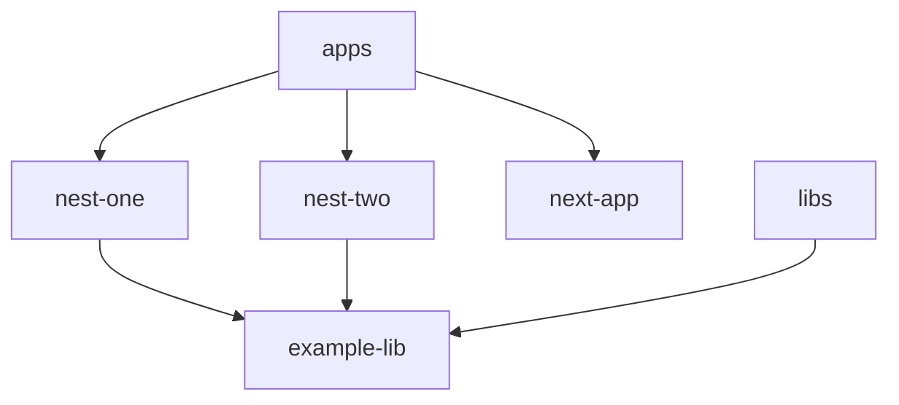
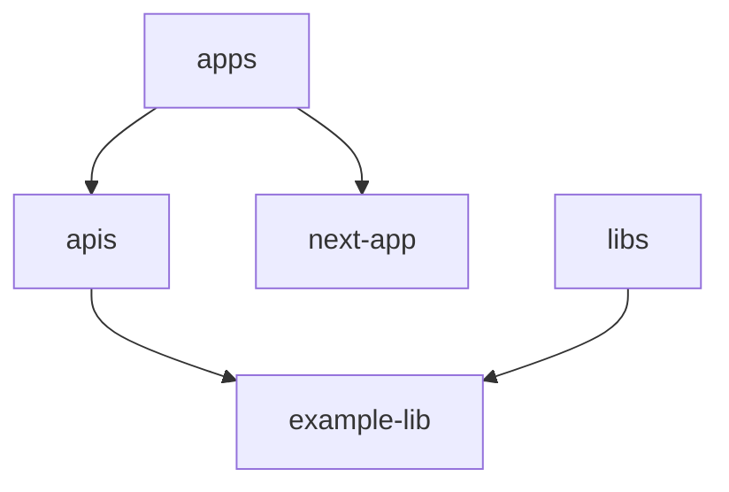

# NestJS Monorepo Examples

Example repo showing NestJS monorepo mode and conventional monorepo setups.

- [conventional-monorepo](./conventional-monorepo) uses a conventional monorepo setup
- [nestjs-monorepo](./nestjs-monorepo) uses NestJS's bespoke monorepo setup

## Main Differences

| Feature | Conventional Monorepo | NestJS Monorepo | Why is this a feature? |
| :--- | :---: | :---: | --- |
| Isolated dependency management | ✅ | ❌ | Whether each app can control its own dependencies and lock to specific version if needed. Allows apps to be upgraded one at a time instead of all at once. Dependencies for specific apps are only added to that app, not the root `package.json`. |
| Isolated build configuration | ✅ | ❌ | Whether the build conifguration can be controlled per-app. NestJS monorepo mode uses Webpack to build the apps which can cause issues with some libs. |
| Reduced boilerplate & configuration | ❌ | ✅ | Fewer things to manage, fewer things to go wrong. |

### Directory Structure

### Conventional Monorepo

### NestJS Monorepo Mode

